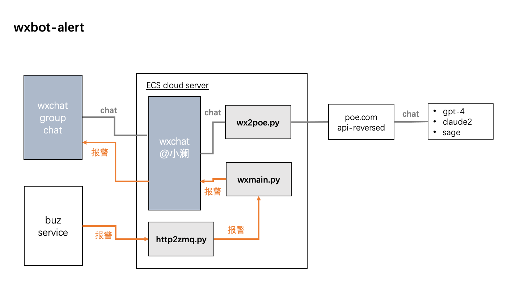

## wxbot-alert
微信报警与chat 机器人

* http 接口接收业务告警投递到指定的微信群group 
* 微信群group @小澜 与llm 进行对话交互问答

## Install 
pip install -i https://mirrors.aliyun.com/pypi/simple/ PyOfficeRobot fire -U
pip install fire pyzmq zmq

## Run

python http2zmq.py run

python wxmain.py run 

python wx2poe.py 

## Test

curl -X POST http://172.16.20.250:51007/elmessage -H 'Content-Type: application/json' -d '{"app":"001","code":"" ,"message":"hello"}'

